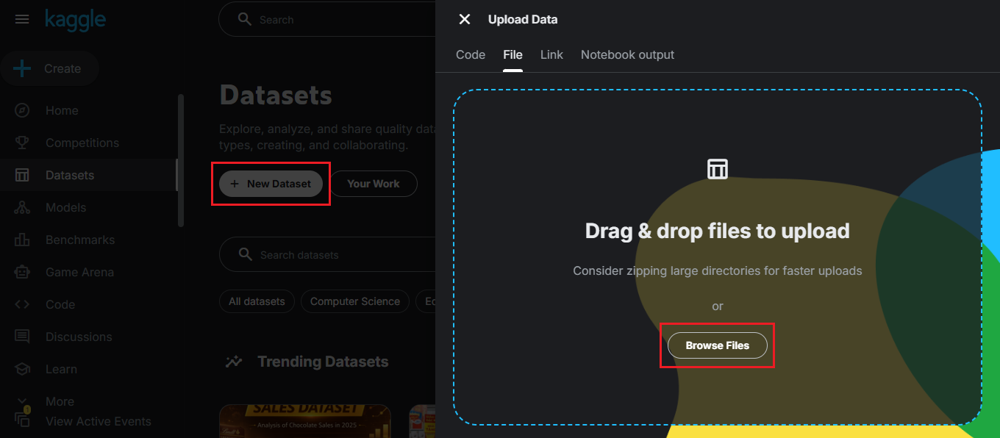
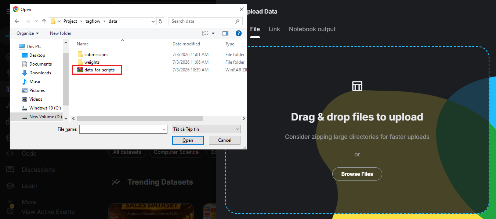
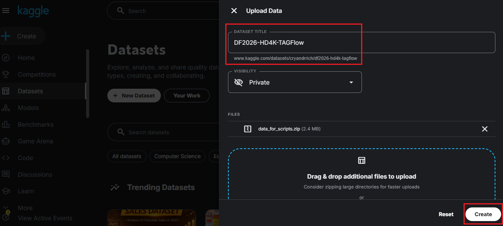
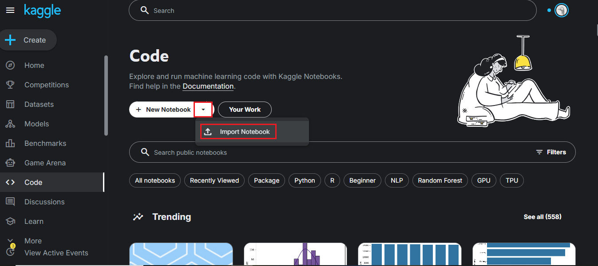
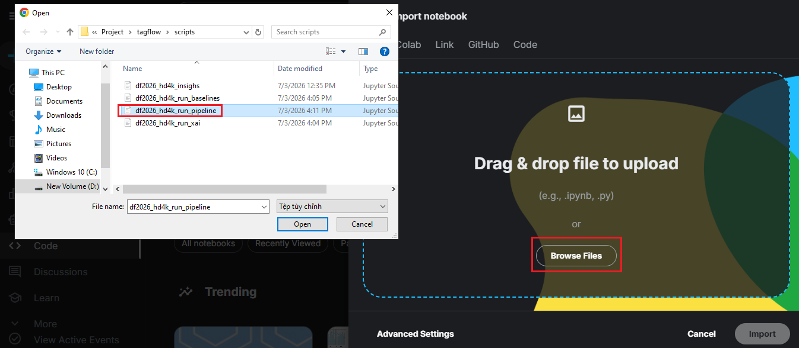
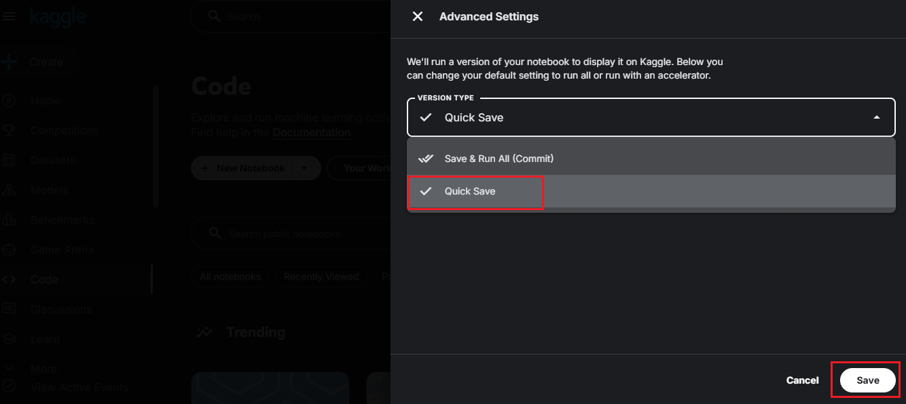
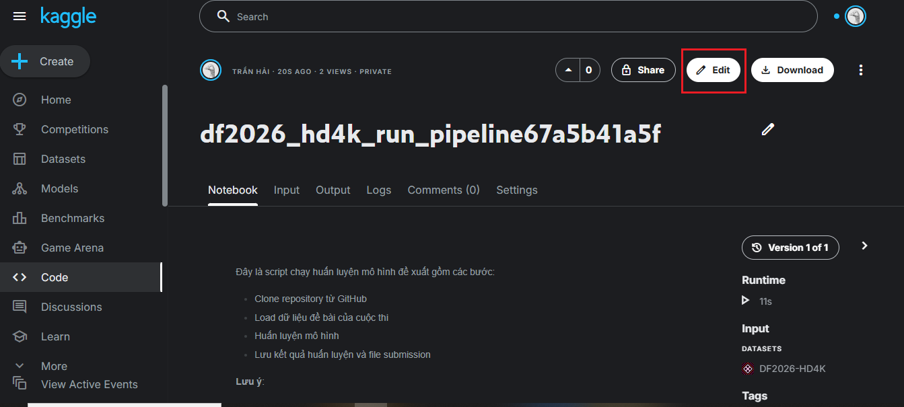
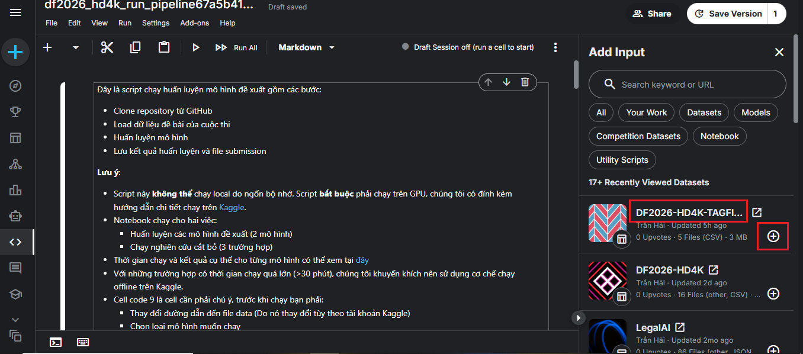
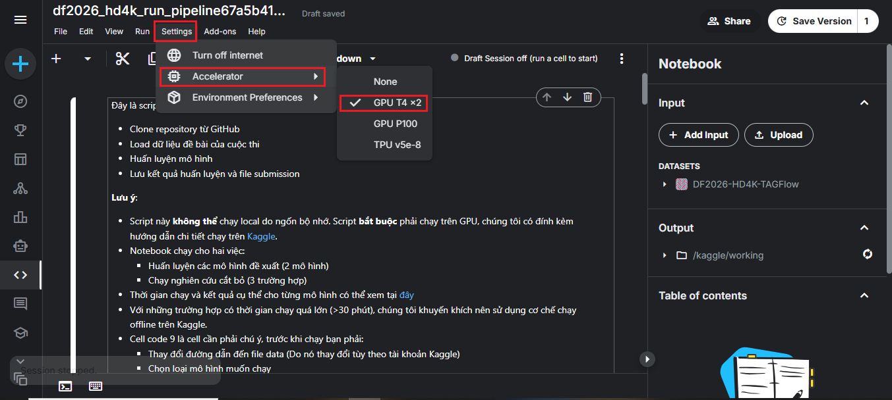
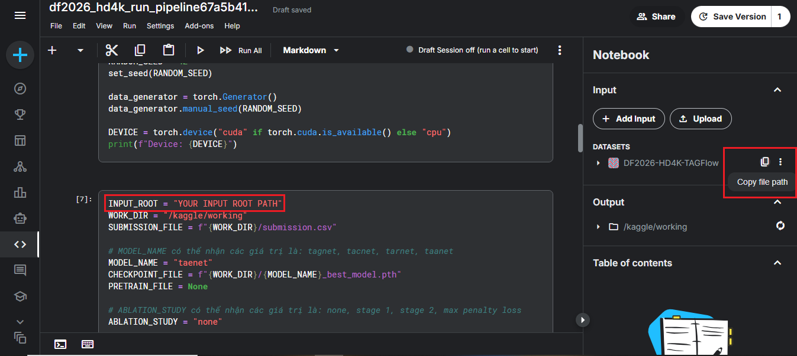

# Hướng dẫn chạy scripts trên Kaggle
Do tính bảo mật của bộ dữ liệu của cuộc thi, các scripts muốn chạy trên Kaggle buộc phải qua một bước tải dữ liệu lên Kaggle để notebook có thể chạy được. File này sẽ hướng dẫn cụ thể cách tải dữ liệu lên và chạy notebook.

## Bước 1: Tạo Datasets trên Kaggle
- Truy cập vào trang [Kaggle Datasets](https://www.kaggle.com/datasets), bấm "+ New Dataset" rồi tiếp tục bấm "Browse Files".

- Tìm trong thư mục tagflow, file data/data_for_scripts.zip là file chứa dữ liệu để chạy notebook. File zip này là file nén 5 file dữ liệu (csv) của cuộc thi.

- Thực hiện đặt tên Datasets là "DF2026-HD4K-TAGFlow" (**Bắt buộc**) và bấm "Create", việc này sẽ tốn khoảng 2-3 phút. Sau khi hoàn thành thì tắt tab này đi.

## Bước 2: Tải notebook lên Kaggle
- Truy cập vào trang [Kaggle Notebooks](https://www.kaggle.com/code). Bấm vào mũi tên bên cạnh "+ New Notebook", chọn "Import Notebook".

- Bấm "Browse Files" và bạn chọn một trong các scripts muốn chạy trong thư mục tagflow/scripts.

- Ở góc dưới bên trái, bấm vào nút "Advanced Settings" và chỉnh Version Type thành "Quick Save" (để tránh notebook tự chạy lúc mới tải lên) sau đó bấm "Save" rồi bấm "Import" và đợi 10-20 giây.

## Bước 3: Kết nối Datasets với Notebook
- Sau khi tải notebook lên xong và hiện ra giao diện như hình dưới, bấm vào phần "Edit" ở góc trên bên phải.

- Ở bên phải, bấm vào nút "+ Add Input". Thông thường, bộ dataset "DF2026-HD4K-TAGFlow" bạn vừa tạo sẽ xuất hiện đầu tiên do bạn mới tạo, nếu không thấy bạn có thể tìm kiếm nó trong thanh tìm kiếm bằng dán URL. Bấm vào dấu "+". Khi dấu "+" chuyển thành dấu "-" tức là đã thành công, bấm vào dấu "X" ở bên phải chữ Add Input.

- Trong trường hợp ghi chú đầu tiên notebook yêu cầu bắt buộc phải chạy trên GPU, bấm vào phần "Settings" ở góc trên bên phải, kéo xuống phần "Accelerator" và chọn "GPU T2 x2".

- Cuối cùng, đảm bảo đường dẫn đến thư mục chứa dữ liệu chính xác. Đưa chuột về phía ký hiệu bộ dataset "DF2026-HD4K-TAGFlow" ở bên phải, sẽ hiện lên một ký hiệu với chú thích là "Copy file path". Bấm vào đó để copy đường dẫn bộ dataset, sau đó tìm dòng code INPUT_ROOT = "YOUR INPUT ROOT PATH" để dán đường dẫn vào. Vị trí dòng code sẽ được nói ở cell chú thích đầu tiên của notebook.

- Sau khi hoàn thành các bước trên, giờ bạn có thể thoải mái bấm "Run all" hoặc "Save version" và ngồi chờ code chạy xong. Thời gian chạy chi tiết đều được đề cập ở mỗi notebook.